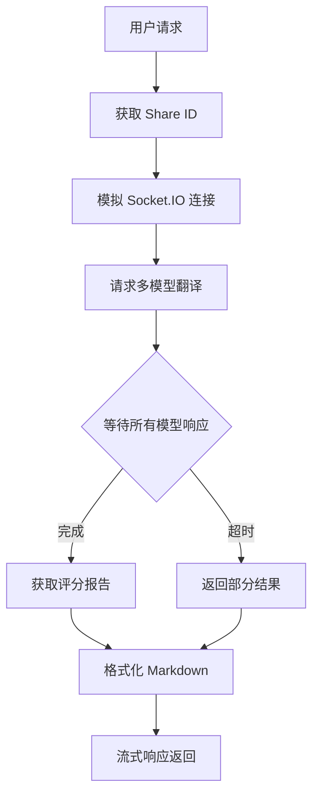

# 🤖 machinetranslation-2api: 你的私人多引擎翻译中枢 🚀

[]
]
[]
]

> "我们不是在编写代码，我们是在构建桥梁。一座连接封闭与开放，连接已知与未知的桥梁。"

欢迎来到 `machinetranslation-2api` 的世界！这是一个创新的项目，它将强大的 [MachineTranslation.com](https://www.machinetranslation.com) 多引擎翻译服务，转化为一个完全兼容 OpenAI `v1/chat/completions` 格式的 API。

**这意味着什么？** 你可以使用熟悉的 OpenAI SDK、客户端或任何支持 OpenAI 格式的工具（如 [Cherry Studio](https://github.com/gngpp/cherry-studio)），来调用集成了 GPT、Gemini、Claude 等多种顶尖模型的超级翻译服务！

---

## 📜 目录

- [🌟 项目亮点与哲学](#-项目亮点与哲学)
- [📂 项目架构](#-项目架构)
- [🚀 快速开始](#-快速开始)
- [🧠 核心原理](#-核心原理)
- [🛠️ 技术栈](#️-技术栈)
- [🎯 使用场景](#-使用场景)
- [📈 项目规划](#-项目规划)
- [🤝 贡献指南](#-贡献指南)
- [📄 开源协议](#-开源协议)

---

## 🌟 项目亮点与哲学

这个项目不仅是一个工具，更代表了一种开放互联的精神：

### ✨ 核心优势

- **🌍 开放兼容**: 将专有服务转化为开放标准（OpenAI API），赋予无限连接可能性
- **🚀 无缝集成**: 无需改变现有工作流，直接替换 API 端点即可升级体验
- **🧠 智能聚合**: 一次请求获取多个大模型翻译结果，附带详细评分报告
- **⚡ 高性能**: 基于 FastAPI 和异步 httpx，响应迅速
- **🐳 简易部署**: Docker 容器化，一键启动

### ⚠️ 注意事项

- **❌ 上游依赖**: 项目稳定性依赖于 `machinetranslation.com` 服务
- **🔧 技术风险**: 基于网络协议模拟，可能因上游更新而需要调整

---

## 📂 项目架构

```
📂 machinetranslation-2api/
├── 📄 .env                    # 环境配置文件
├── 📄 .env.example            # 配置模板
├── 📄 Dockerfile              # Docker 镜像构建文件
├── 📄 docker-compose.yml      # 容器编排配置
├── 📄 main.py                 # FastAPI 应用入口
├── 📄 nginx.conf              # Nginx 反向代理配置
├── 📄 requirements.txt        # Python 依赖清单
└── 📂 app/                    # 核心应用代码
    ├── 📂 core/               # 核心配置模块
    │   ├── 📄 __init__.py
    │   └── 📄 config.py       # 配置管理
    ├── 📂 providers/          # API 提供者
    │   ├── 📄 __init__.py
    │   ├── 📄 base_provider.py
    │   └── 📄 machinetranslation_provider.py  # 核心交互逻辑
    └── 📂 utils/              # 工具函数
        └── 📄 sse_utils.py    # 流式响应工具
```

---

## 🚀 快速开始

### 前提条件

- Docker 和 Docker Compose
- Git

### 部署步骤

**1. 克隆项目**
```bash
git clone https://github.com/lzA6/machinetranslation-2api.git
cd machinetranslation-2api
```

**2. 配置环境**
```bash
cp .env.example .env
# 编辑 .env 文件，设置你的 API 密钥
```

**3. 启动服务**
```bash
docker-compose up -d
```

### 客户端配置

在任何支持 OpenAI 的客户端中使用以下配置：

- **API 地址**: `http://你的服务器IP:8088/v1`
- **API 密钥**: 在 `.env` 中设置的 `API_MASTER_KEY`
- **模型**: `machinetranslation-best` (自动选择最佳) 或指定模型

---

## 🧠 核心原理

项目通过精密的网络协议模拟，实现与上游服务的交互：



### 🔄 详细流程

1. **🎫 获取身份凭证** - 向上游服务注册翻译任务，获取唯一 `share_id`
2. **📡 建立实时连接** - 模拟 Socket.IO 客户端，与上游建立通信通道
3. **🤖 并发翻译请求** - 向多个大模型同时发起翻译任务
4. **📊 收集评分结果** - 等待所有模型返回并获取权威评分
5. **🎁 格式化输出** - 将结果转换为美观的 Markdown 格式
6. **⚡ 流式响应** - 通过 SSE 协议兼容返回给客户端

---

## 🛠️ 技术栈

| 技术组件 | 用途说明 | 技术评价 | 难度 |
|---------|----------|----------|------|
| **FastAPI** | API 服务框架 | 高性能异步 Web 框架，自动生成 API 文档 | ★★★☆☆ |
| **Uvicorn** | ASGI 服务器 | 基于 uvloop 的高性能服务器 | ★★☆☆☆ |
| **httpx** | HTTP 客户端 | 支持异步的全功能 HTTP 客户端 | ★★★☆☆ |
| **Socket.IO 模拟** | 实时通信 | 逆向工程实现的协议模拟 | ★★★★★ |
| **Loguru** | 日志系统 | 简单强大的日志记录工具 | ★☆☆☆☆ |
| **Pydantic Settings** | 配置管理 | 类型安全的配置管理系统 | ★★☆☆☆ |
| **Docker** | 容器化 | 应用打包和部署 | ★★★☆☆ |
| **Nginx** | 反向代理 | 高性能 Web 服务器和代理 | ★★☆☆☆ |

---

## 🎯 使用场景

### 🎓 学术研究
- 专业术语和文献的多引擎对比翻译
- 获取带权威评分的翻译质量分析

### 💻 开发工具
- 集成到代码编辑器的翻译插件
- 文档阅读和代码注释的智能翻译

### ✍️ 内容创作
- 多语言博客和视频字幕的翻译辅助
- 跨语言内容的质量对比和优化

### 🔧 技术探索
- 学习网络协议分析和逆向工程
- 理解多模型聚合服务的实现原理

---

## 📈 项目规划

### ✅ 已完成功能
- [x] OpenAI API 格式兼容
- [x] 多模型翻译结果聚合
- [x] 智能评分和报告生成
- [x] Docker 容器化部署
- [x] 流式响应支持

### 🚧 当前局限
- 依赖上游服务的稳定性
- Socket.IO 模拟可能存在兼容性问题
- 缺乏缓存和重试机制

### 🎯 未来规划

#### 短期目标 (v1.1)
- [ ] 实现 Redis 缓存层
- [ ] 增强错误处理和重试机制
- [ ] 添加基础的健康检查

#### 中期目标 (v1.5)
- [ ] 实现真正的 WebSocket 客户端
- [ ] 开发简易 Web 管理界面
- [ ] 添加 Prometheus 监控指标

#### 长期愿景 (v2.0)
- [ ] 支持文档翻译功能
- [ ] 实现模型负载均衡
- [ ] 开发插件化架构

---

## 🤝 贡献指南

我们欢迎所有形式的贡献！你可以通过以下方式参与：

### 🐛 报告问题
在 [Issues](https://github.com/lzA6/machinetranslation-2api/issues) 页面报告 Bug 或提出新功能建议。

### 💻 代码贡献
1. Fork 本项目
2. 创建功能分支 (`git checkout -b feature/AmazingFeature`)
3. 提交更改 (`git commit -m 'Add some AmazingFeature'`)
4. 推送到分支 (`git push origin feature/AmazingFeature`)
5. 创建 Pull Request

### 📚 文档改进
帮助改进文档、翻译或添加使用示例。

### 🧪 测试帮助
协助编写单元测试和集成测试。

---

## 📄 开源协议

本项目采用 **Apache 2.0** 开源协议。

**简单来说：**
- ✅ 可以自由使用、修改和分发代码
- ✅ 可用于商业项目
- ✅ 允许专利使用
- 📝 需要保留原始版权声明
- ⚠️ 不提供任何担保

完整协议内容请查看 [LICENSE](https://opensource.org/licenses/Apache-2.0) 文件。

---

## 🎉 快速体验

准备好开始了吗？这里有一个快速测试示例：

```bash
# 使用 curl 测试服务
curl -X POST "http://localhost:8088/v1/chat/completions" \
  -H "Content-Type: application/json" \
  -H "Authorization: Bearer your-api-key" \
  -d '{
    "model": "machinetranslation-best",
    "messages": [{"role": "user", "content": "Hello, world!"}],
    "stream": true
  }'
```

**加入我们，一起构建更智能的翻译未来！** 🌟

---
